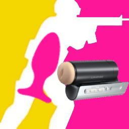

  

# CS2 Love

Reward yourself for playing well! **CS2 Love** is a small app that connects Counter-Strike 2 to your Lovense (or any other [Buttplug-supported](https://iostindex.com/) toy) through [Intiface Central](https://intiface.com/central), buzzing your toy when you get a kill and giving you a longer reward at the end of a strong round. Pair it with [CS2Shock](https://github.com/OstlerDev/cs2shock) to layer positive reinforcement on top of negative reinforcement for full behavioral training.

## What You Need

- Counter-Strike 2
- A Buttplug-compatible toy (Lovense, Kiiroo, We-Vibe, Magic Motion, Satisfyer, etc. - see the [hardware index](https://iostindex.com/))
- [Intiface Central](https://intiface.com/central) installed and running with **Start Server** pressed

## Quick Start Guide

1. Download and launch `cs2love.exe`.
2. Open Intiface Central, press **Start Server**, and pair your toy through the **Devices** tab.
3. In CS2 Love, follow the **Setup Guide** to install the CS2 integration, enter the Intiface URL (default `ws://127.0.0.1:12345`), and pick the toys you want to use.
4. Hit **Test vibrate** to confirm everything is wired up.
5. Jump into a live CS2 match and rack up some kills.

## Customizing Your Experience

CS2 Love has two independent reward channels - sound and vibration - and each one fires both on every kill and at the end of strong rounds.

### Vibration Rewards
- **Kill Vibration**: Fires a short buzz the moment your in-round kill counter goes up. Configure the strength (0-100%) and duration (100 ms - 10 s).
- **End-of-Round Vibration**: When you hit the configured round-kill threshold, a longer reward buzz plays at round end. Configure the threshold (1-5 kills), strength, and duration independently of the kill vibration.
- **Trigger Mode**: The end-of-round vibration can fire **Always when threshold met**, or **Only if team wins** the round.
- **Multi-Toy**: Selecting more than one toy fires the same reward on all of them in parallel. Per-device commands are serialized so back-to-back kills queue up cleanly instead of cancelling each other.

### Sound Rewards
Pair the vibration with classic clicker-style sound feedback. CS2 Love can play a sound on every kill and a separate "good job" sound at the end of a round when you hit a kill threshold.

- **Instant Kill Reward**: Plays a short sound the moment your match kill counter goes up while you're in a live round. Defaults to a quiet `clicker.wav` for clicker-training pairing.
- **End-of-Round Reward**: At the end of a round, if your in-round kills met the configured threshold, plays a longer reward sound. Defaults to `goodpuppy1.wav`.
- **Trigger Mode**: Same **Always** vs **Only if team wins** gating as the vibration reward.
- **Volume**: Each sound reward has its own 0-200% volume slider in case the sound needs a boost over your game audio.
- **Custom Sounds**: Pick the bundled defaults from the dropdown, or choose your own `.wav`, `.mp3`, `.ogg`, or `.flac` file. A "Preview" button next to each picker lets you audition the sound before saving.

All rewards are gated to live rounds only, so warmup, freezetime, and intermission kills will not trigger them.

## Running Alongside CS2Shock

CS2 Love is designed to coexist with [CS2Shock](https://github.com/OstlerDev/cs2shock) - they listen on different GSI ports (`3001` for CS2 Love, `3000` for CS2Shock) and write separate cfg files (`gamestate_integration_cs2love.cfg` vs `gamestate_integration_cs2shock.cfg`), so CS2 happily fans events to both apps in parallel.

## Troubleshooting

**Why isn't my toy buzzing?**
- Make sure Intiface Central is running and **Start Server** has been pressed. CS2 Love re-attempts to connect every 2 seconds, so starting Intiface (or restarting it) while CS2 Love is open is enough - you do not have to restart CS2 Love or re-enter the URL.
- In Intiface Central, press **Start Scanning** and confirm your toy appears in the **Devices** tab. CS2 Love mirrors whatever Intiface is connected to, so a toy that is live in Intiface should show up in CS2 Love's toy list automatically.
- Tick the toy in CS2 Love's toy list so vibration rewards target it.
- Use **Test vibrate** to send a 1-second 50% buzz directly to your selected toys - if that fails, the issue is between CS2 Love and Intiface, not with CS2.
- Check the logs for the app to see what might have happened.

**Why is the app not reacting to gameplay at all?**
- Make sure the CS2 integration was installed correctly (the app should say it's installed).
- Ensure you are playing a **live match**. The app ignores kills during warmup, freezetime, and intermission.
- If you are also running CS2Shock, both cfg files need to live in the CS2 cfg folder side-by-side.

**Why isn't my sound reward playing?**
- Confirm the reward checkbox is enabled and use the "Preview" button next to the sound picker to verify your audio output works.
- If you picked a custom file, make sure the file still exists at that path. Moving or renaming it after selection will silently fail playback (check the logs).
- Sound rewards are suppressed outside of live rounds, so kills during warmup or freezetime will not trigger them.

## Advanced & Technical Details

Are you a developer, or just curious about how CS2 Love works under the hood? Check out the [Technical Details (TECHDETAILS.md)](TECHDETAILS.md) for information on the Buttplug / Intiface integration, the raw configuration file format, and instructions on how to build the app from source.
